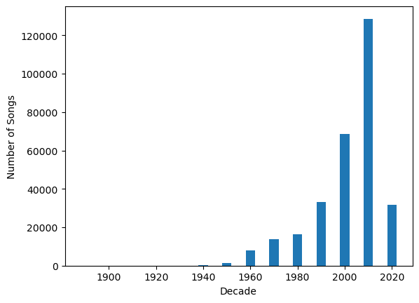
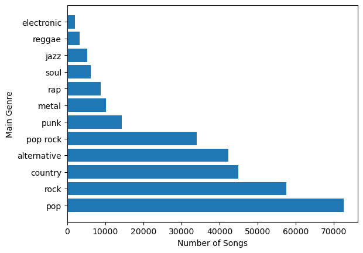
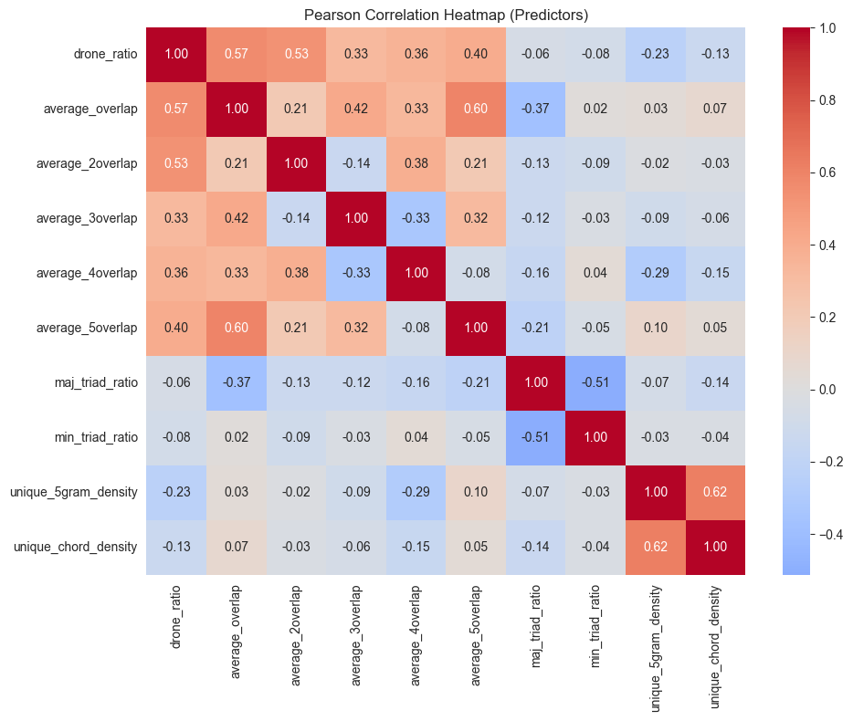
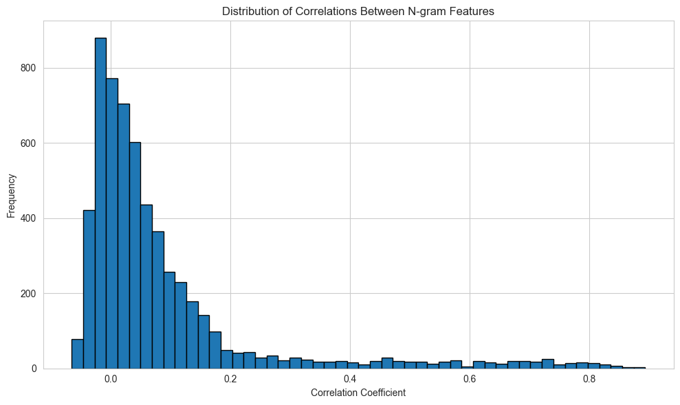
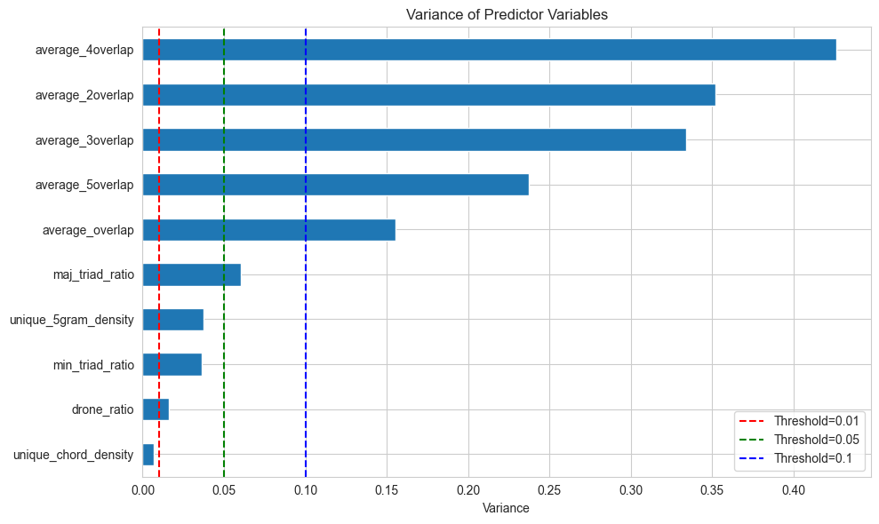
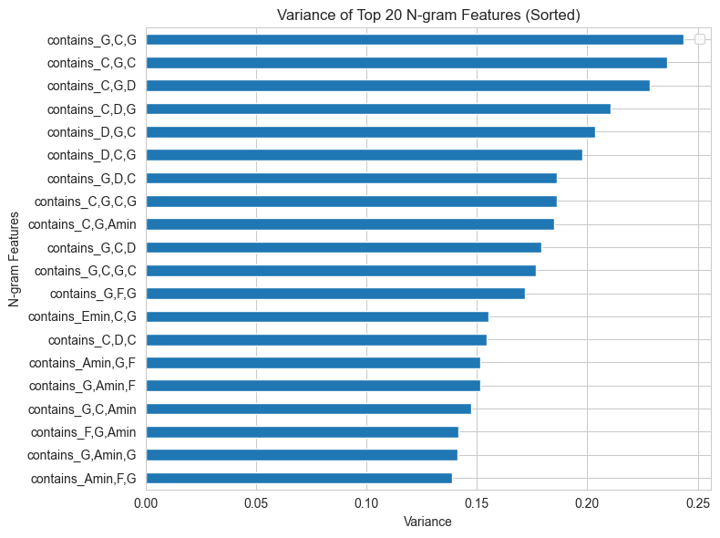
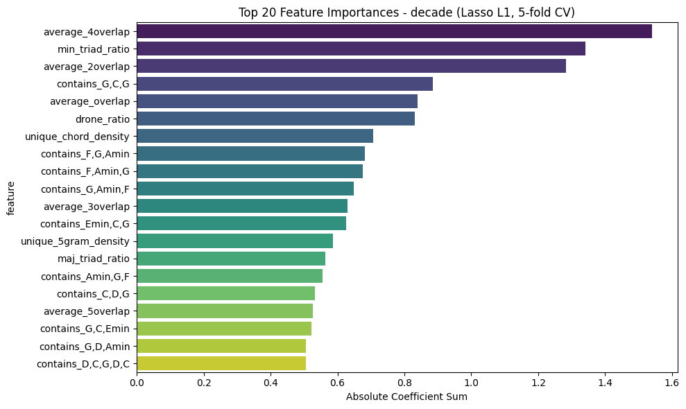
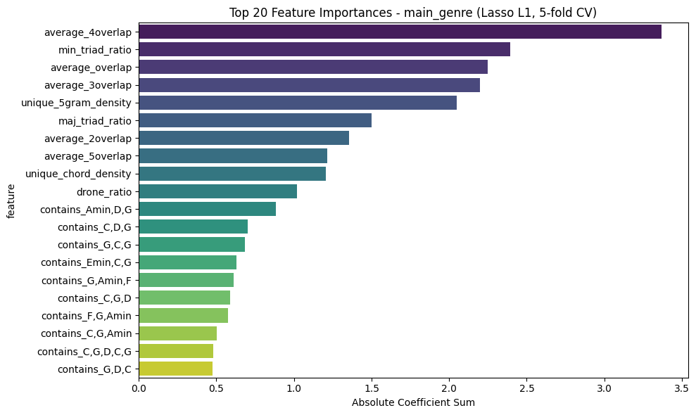

#                                                                             
 Harmonic Features for Song Recommendations 

[Google Drive for raw datasets](https://drive.google.com/drive/folders/1wQqr2Wh-QhNbvWzvqfjFSGo5dHFz1YxF?usp=drive_link)

Team members: [Juan Salinas](https://github.com/juansalinas2), [Iliyana Dobreva](https://github.com/iliyanadobreva), [Joshua Ruiter](https://github.com/JoshuaRuiter), [Matthew Dykes](https://github.com/mmd266-svg), [Elizabeth Rizor](https://github.com/ejrise)

#  Table of Contents

1. [Introduction](#introduction)  
2. [Dataset Curation](#dataset-curation)  
3. [Data Cleaning and EDA](#data-cleaning-and-EDA)  
4. [Feature Engineering](#feature-engineering) 
5. [Feature Selection](#feature-selection) 
5. [Modeling](#modeling)
5. [Results](#results)  
6. [Conclusion](#conclusion)  
7. [Description of Repository](#description-of-repository)  

## Introduction
&nbsp;&nbsp;&nbsp;&nbsp; Music has served as an important medium for human expression for tens of thousands of years. Songs can be broken down into quantifiable harmonic patterns that can signal a cultural moment in time or belonging to a specific subculture. Mapping these harmonic features to markers of cultural relevance are useful for musicians, researchers, and businesses (such as streaming platforms) who wish to better recommend songs to individuals. Because of this need, we aimed to explore how harmony shapes the sound of popular music, and determine whether harmonic "fingerprints" can accurately classify songs by genre, decade, and popularity. 

## Dataset Curation 
&nbsp;&nbsp;&nbsp;&nbsp; Our primary dataset was the Chordonomicon dataset, which contains over 600,000 chord-annotated songs along with their release decade, genre, and Spotify ID. To predict popularity, we scraped Spotify current popularity metrics with each song's Spotify ID (when available). We also used the Billboard Hot 100 dataset (contains all songs on Billboard Hot 100 going back to its inception) to label whether a song had ever reached the top charts in the US. 
1. [Chordonomincon Dataset](https://huggingface.co/datasets/ailsntua/Chordonomicon)
2. [Spotify API](https://developer.spotify.com/)
3. [Hot 100 Dataset](https://github.com/utdata/rwd-billboard-data/blob/main/data-out/hot-100-current.csv)

## Data Cleaning and EDA
The raw Chordonomicon dataset is a 679,307 $\times$ 10 data frame, with each entry representing a song and features representing information regarding song identification, chord progression, genre, year and artist identification. Since our hypothesis is that information contained in the chord progression can be used to predict the genre, release decade or popularity of a song, we only retain three of these features as targets:
* main_genre: categorical feature with 12 possibilites
* decade: release decade from 1890s-2020s, categorical variable with 13 possibilities
* spotify_song_id: song identification string, can be merged with Spotify data to generate a popularity measure

The first data cleaning step is to remove all other features not involving chord progression information. We also remove any song entries which have n/a recorded for any one of our target variables, which removes half our data entires, but this is acceptable since our data frame is so large to begin with. Next, we take a look at the distribution of the main_genre and decade features:

  

  

We see extreme class imbalance for all decades prior to the 1950s, which have class counts less than 1/1000 of the largest class, so we focus our analysis on decades beyond the 1940s. Main_genre also shows imbalance, but we retail all classes because the smallest classes are still well within a factor of 50 of the largest class and have counts in the thousands. 

We find that a small portion of the resulting data frame (about 0.2%) consists of songs whose chord progressions contain fewer than 6 total chords (i.e. fewer than 5 chord changes). Since we plan on test chord progression-related features which are functions of sequences of up to 5 chords, we also remove these entries from the data frame. 

Our final data frame is size 300,713 $\times$ (3+ # of chord progression-derived predictors)
The notebook to get the final cleaned dataset is [here](https://github.com/Erdos-Projects/fall-2025-harmonic-features-for-song-recommendations/tree/main/Final/final_clean.ipynb).

## Feature Engineering

We considered a large variety of features in our analysis of the Chordonomicon dataset. All features considered or used were ultimately derived from the original "chords" feature. In the initial data, the chords of a song are recorded as a string, listing chord names such as "C", "Amin," and "Gdim7." Along with chord names, the original chord data contains section labels such as "\<intro_1\>" and "\<chorus_1\>", as well as inversion markers such as "C/E" to indicate a C major chord in first inversion. 

While we initially considered some features involving section labels, a sizable fraction of the dataset contained no section labels, so rather than filter by songs with labels (which would significantly reduce the number of entries), we processed all of the chord data to remove all section labels. Regarding inversions, we decided based on domain-specific knowledge that inversions are not central enough to harmonic analysis to be useful for analyzing a target such as genre, so we also processed songs to remove inversion markers. The "cleaned up" version of the initial chords feature was then stored in a "simplified_chords" feature columnn, from which all of our other features derive.

Our final list of model features fits broadly into two categories: "contains x" where x is an n-gram, and various other more "holistic" features. Before describing the features, it is useful to set up a bit of mathematical framework for chords, chord progressions, and harmonic equivalence. 

**Chords** are represented as strings (e.g. 'C' or 'Amin'), or as binary vectors of length 12 ('C' corresponds to $[1,0,0,0,1,0,0,1,0,0,0,0]$). The data represents chords within songs as string labels, and provides the file "chords_mapping.csv" for converting from a string to vector. Mathematically, the space of chords is $X = \{0,1\}^{12}$. The cyclic group $G = \mathbb{Z}/12 \mathbb{Z}$ acts on $X$ by cyclically permuting vectors, which corresponds musically to transposition. Two chords are **harmonically equivalent** of they are in the same orbit of this group action, so the set of chords up to harmonic equivalence is the quotient space $X/G$. Musically speaking, two chords are harmonically equivalent if one of them is a transposition of the other. More generally, an $n$-gram is a tuple from $X^n$, and $G$ acts entry-wise on $X^n$, and two $n$-grams are harmonically equivalent if they lie in the same $G$-orbit. The general space of $n$-grams up to equivalence is

$$\bigcup_{n \ge 1} (X^n/G)$$

**n-gram features.** Fix an $n$-gram $x \in X^n$, and let $\overline{x} \in X^n/G$ be the orbit of $x$. The $n$-gram feature ''contains_$x$" is a binary feature denoting whether a given song contains any element of $\overline{x}$, i.e. any $n$-gram harmonically equivalent to $x$. There are far too many $n$-grams to use even a small fraction as features in this way. Just considering $n=1$, the full orbit space $X/G$ has 352 elements, of which 44 are occur in the training data. The orbit space $X^2/G$ has over 1 million elements, of which 5903 occur in the training data. In order to restrict to a more feasible set of $n$-grams, we first decided, based on domain knowledge, that sequences longer than $n=5$ are longer than a typical musical idea or phrase, and will not be useful for distinguishing genre. On the other hand, sequences of length $n=1$ or $n=2$ are frequent enough to be not useful for distinguishing. That leaves $3$-grams, $4$-grams, and $5$-grams. In order to try and select for $n$-grams which occur in a meaningful enough number of songs, we gathered the most frequent raw $n$-grams (the top 100 for each $n$), then passed that list through the harmonic equivalence quotienting process, leaving around $40$ distinct classes for each $n$.

Another reason for excluding $1$-grams and $2$-grams from our features is that they are significantly redundant with longer $n$-grams. For example, any song containing 'F,G,C' will necessarily contain 'F' and 'F,G' and 'G,C'. While this is not literal collinearity of feature columns, it could lead to near-collinearity.

**Holistic features.** In order to explore the data and view songs in a format roughly approximating traditional sheet music, we created a "string_to_chord_matrix" method which takes in a chord sequence such as 'C,G,C,G' and outputs a matrix whose rows are binary chord vectors of length 12, one for each chord. After an appropriate transoformation (reversing the order of each row and taking the matrix transpose), the resulting binary matrix becomes a "left-to-right" view of the notes in the song, with higher notes corresponding to higher 1's. From this view, we created various features:

* missing_notes - The number of zero rows in a chord matrix, measuring the number of tones from the 12-tone scale never used throughout a song. This feature is discrete, necessarily between 0 and 12, though realistically will be between 0-5 for most songs.

* drone_ratio - A measurement of how close a song is to having a "drone," a single note played throughout the entire song. This metric is essentially continuous, giving a number in $[0,1]$ where a value of 1 indicates that the song contains a note played in every chord, while 0.5 indicates that the most common single note appears in only half of the chords. Concretely, this is calculated by taking the maximum value among the 12 column sums of a chord matrix, and dividing by the number of rows.

* average_overlap - A measurement of how much sequential pairs of chords overlap in notes. Concretely, for each sequential pair of chords in a song, take the dot product of those two chord vectors, then average this similarity metric across all sequential pairs in the song. As a concrete example, the sequential overlap in 'C,Amin' is 2, as C and A minor share the notes E and C.

* average_2overlap, average_3overlap, average_4overlap, average_5overlap - Generalizations of average_overlap, where the number following indicates a time lag, so e.g. average_overlap2 takes similarities between a chord and the chord two after it, averaged over all possible such pairs in a song.

* maj_triad_ratio - The fraction of chords in a song that are major triads.

* min_triad_ratio - The fraction of chords in a song that are minor triads.

* unique_chord_density - The number of distinct chords in a song divided by the total number of chords. Note that for the purposes of this metric, harmonically equivalent chords may still be considered distinct.

* unique_5_gram_density - The number of distinct 5-grams divided by the total number of chords. Note that for the purposes of this metric, harmonically equivalent chords may still be considered distinct.

The notebooks to obtain the final features can be found [here for n-gram features](https://github.com/Erdos-Projects/fall-2025-harmonic-features-for-song-recommendations/blob/main/Final/n_gram_features.ipynb), [here for non-density holistic features](https://github.com/Erdos-Projects/fall-2025-harmonic-features-for-song-recommendations/blob/main/Final/possible_matrix_features.ipynb), and [here for density holistic features](https://github.com/Erdos-Projects/fall-2025-harmonic-features-for-song-recommendations/blob/main/Final/possible_density_features.ipynb). 

## Feature Selection

Though we had already eliminated some redundant features (for example, unique 2,3,4 gram density), we then engaged in a more formal feature selection process to determine which would be most appropriate for our final model. 

We performed several feature selection methods, including LASSO (L1) regularization with 5 folds, variance thresholding, and multicollinearity analysis.

### Multicollinearity
Holistic features are continuous numerical variables, while n-grams are discrete binary features. Because of these different representations, we initially analyzed each feature set separately.

  

The Pearson correlation heatmap above of holistic variables shows that most correlations fall in the moderate (around ±0.4–0.6) or weak (below ±0.3) range, and there are no very strong correlations. 

  

The n-gram feature set contains over 100 binary variables, so a correlation heatmap would not provide a clear visualization. Instead, the histogram above shows the distribution of pairwise correlation coefficients between all n-gram features. Most correlations cluster near zero, indicating that the majority of n-gram features are weakly correlated.

The notebooks performing multicollinearity analysis can be found [here for holistic features](feature_engineering/feature_selection/2_eda_and_multicollinearity_holistic.ipynb) and [here for n-gram features](feature_engineering/feature_selection/2_eda_and_multicollinearity_n-grams.ipynb).

###  Variance Thresholding

  

To assess the variability of holistic features, we applied variance thresholding. The bar chart above shows each feature’s variance, with reference lines at thresholds of 0.01 (conservative), 0.05 (moderate), and 0.1 (aggressive). The conservative threshold removes only one feature, while the moderate and aggressive thresholds would eliminate drone ratio, which, despite its low variance, is one of the most predictive features for the top 100 target variable.

  

The plot above shows the top 20 n-gram features ranked by variance. The highest-variance features are predominantly 3-grams, indicating that shorter chord sequences contribute more variability across the dataset than longer ones. Additionally, most of the top-variance n-grams involve the chords G and C, often in combination with each other or nearby transitions such as C-G-D. This suggests that chord progressions centered around G and C are the most variable.

The notebooks performing variance thresholding can be found [here for holistic features](feature_engineering/feature_selection/3_variance_threshold_holistic.ipynb) and [here for n-gram features](feature_engineering/feature_selection/3_variance_threshold_n-grams.ipynb).

### LASSO (L1) Regularization Feature Selection for Decade and Genre

Lasso, or Least Absolute Shrinkage and Selection Operator, uses L1 regularization, which adds a penalty based on the absolute value of each feature’s coefficient. These coefficients represent how much each feature contributes to predicting the target. By applying this penalty, Lasso pushes the coefficients of less important features toward zero. We used the resulting coefficients to create CSV files containing feature importance scores for each target variable.

  
  

Presented above are two plots that show the top 20 features for predicting decade and genre. We can see that the top two features are the same for both: the measure of how much four sequential pairs of chords overlap in notes (average overlap-4) and the fraction of chords in a song that are minor triads (min triad ratio). The rest of the features vary where for Genre we see the holistic features as more important, and for decade we see a combination of holistic and n-gram features.

The notebook performing LASSO (L1) regularization for decade and genre can be found [here](feature_engineering/feature_selection/4_lasso_L1_regularization_main.ipynb).

### Feature Selection for Hot 100

We first conducted a multicollinearity analysis with correlation matrices to determine whether features should be further reduced. This analysis found several features with high multicollinearity (greater than 0.7); to account for this, we ran a loop that would systematically remove features that contribute greatly to collinearity until all pairs were no longer highly correlated. 

We then conducted a multi-step feature selection process on our dataset with both the full feature list and the reduced feature list. This involved variance threshold assessment, random forest feature importance, and LASSO (L1 regularization) regression with cross-validation. This initial process identified potential issues that needed to be addressed, including class imbalance of the hot_100 target and low performance of classifier models when compared to baseline (guess highest occuring class of genre and decade). Trends remained very similar whether we assessed the full or reduced feature lists.

The most important features for the top 100 target were mostly holistic, with drone ratio as the most important feature.

The notebook performing feature selection for Hot 100 target can be found [here](feature_engineering/feature_selection/5_high_correlations_removed.ipynb).

## Modeling

### Hot 100

### Decade

### Genre

We explored many models for genre, particularly focusing on $n$-gram features, but surprisingly these features did not end up being predictive for genre as much as we hoped. Compared to a baseline dummy predictor for genre with 25% accuracy, models based on 3-grams, 4-grams, and 5-grams did no better than 27% accuracy. The "best" model, reaching 28% accuracy, was a random forest with depth 5, based on 8 holistic features: min_triad_ratio, maj_triad ratio, unique_chord_density, drone_ratio, and average_Noverlap for N=2,3,4, and 5. As best we can tell, predicting genre from chord sequences, even when considering harmonic equivalence, is not feasible.  

While it would be possible to create hundreds more $n$-gram feature columns with more time and computational power, our preliminary results suggest that this is unlikely to lead to better predictions for genre or popularity.

## Results

## Conclusions

Our targets, especially genre and decade, are not easily predictable based on the features we had access to. 

## Description of Repository

